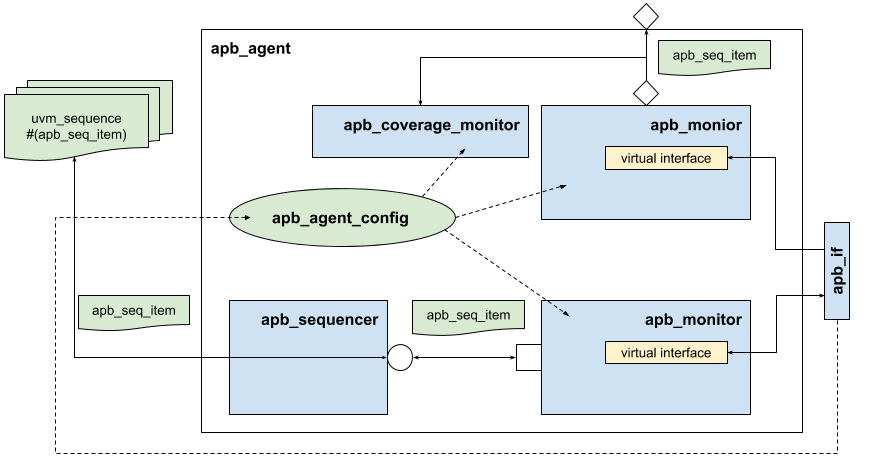

APB Agent UVM Verifivation Component
====================================

Overview
--------

This UVC (UVM Verification Component) implements a simple APB bus agent.
The agent consists of lower level components that yield initiating and
monitoring bus transactions. The agent's structure is captured in the
figure below.

Components of the agent:

- Driver (class apb_driver)
- Monitor (class apb_monitor)
- Sequencer (class apb_sequencer)
- Coverage monitor (class apb_coverage_monitor)

The agent may operate in an active mode, in which it instantiates all the
usual UVC comonents (driver, sequencer, monitor). In a passive mode, the
agent instantiates only the monitor. The operation mode as well as other
features are controlled through an agent's configuration object (class
apb_agent_config).

The agent may be paired with a UVM register model through an adapter class
reg2apb_adapter.




Basic Use
---------

The following code shows the basic integration of the APB agent into an environment.

```
class my_env extends uvm_env;

apb_agent_pkg::apb_agent m_apb_agent;

function void build_phase(uvm_phase phase);
    apb_agent_pkg::apb_agent_config l_apb_agent_cfg;

    // setup agent's configuration
    l_apb_agent_cfg = ...

    // instantiate the agent
    uvm_config_db #(apb_agent_pkg::apb_agent_config)::set(this, "m_apb_agent*", "apb_agent_config", l_apb_agent_cfg);
    m_apb_agent = apb_agent::type_id::create("m_apb_agent", this);

    ...
endfunction: build_phase

function void connect_phase(uvm_phase phase);
    ...
    // Set up the agent sequencers as resources:
    uvm_config_db #(apb_agent_pkg::apb_sequencer)::set(null, "*", "apb_sequencer", m_apb_agent.m_sequencer);
    ...
endfunction: connect_phase

endclass: my_env
```


Using Register Model
--------------------

Some extra code is needed to pair the agent with a register model.

```
class my_env extends uvm_env;

my_env_config m_cfg; // environment config (includes a register model `my_rm`)

uvm_reg_predictor#(apb_agent_pkg::apb_seq_item) apb2reg_predictor; // we will use an explicit predictor

function void spi_env::build_phase(uvm_phase phase);
    if(!uvm_config_db #(my_env_config)::get(this, "", "my_env_config", m_cfg)) begin
        `uvm_error("build_phase", "Failed to find my_env_config")
    end
    ...
    // build apb_agent
    ...
    // Build the register model predictor
    apb2reg_predictor = uvm_reg_predictor #(apb_agent_pkg::apb_seq_item)::type_id::create("apb2reg_predictor", this);
    ...
endfunction:build_phase

function void connect_phase(uvm_phase phase);
    if(m_apb_agent.m_cfg.active == UVM_ACTIVE) begin
        apb_agent_pkg::reg2apb_adapter reg2apb;
        reg2apb = reg2apb_adapter::type_id::create("reg2apb");

        // Only set up register sequencer layering if the top level env
        if(m_cfg.my_rm.get_parent() == null) begin
            m_cfg.my_rm.APB_map.set_sequencer(m_apb_agent.m_sequencer, reg2apb);
        end

        // Replacing implicit register model prediction with explicit prediction
        // based on APB bus activity observed by the APB agent monitor
        // Set the predictor map:
        apb2reg_predictor.map = m_cfg.my_rm.APB_map;
        // Set the predictor adapter:
        apb2reg_predictor.adapter = reg2apb;
        // Disable the register models auto-prediction
        m_cfg.my_rm.APB_map.set_auto_predict(0);
        // Connect the predictor to the bus agent monitor analysis port
        m_apb_agent.ap.connect(apb2reg_predictor.bus_in);
    end
    ...
endfunction: connect_phase

endclass: my_env
```
